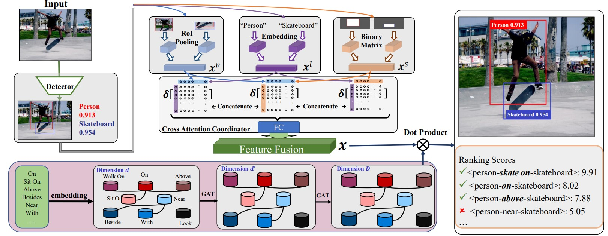

# Intro

Upload the paper "Towards Balanced Visual Relationship Detection by Decoupled Representation and Classifier Learning", whose submitting name is "Scene Graph Generation via Multi-Relation Classification and Cross-modal Atention Coordinator" in MMAsia 2020. The paper is accepted by MMAisa 2020, you can find the latter name in https://www.acmmmasia.org/2020/program.html.

# Abstract

Visual relationship detection intends to explore the interactions between object pairs and obtains a triplet <subject-relation-object>. A scene graph could be generated by recognizing all these triplets in the image. However, visual relationship detection today is still limited by imbalanced class prediction. Specifically, most of existing work achieves satisfying performance on simple and frequent relation classes (e.g. on), yet leaving poor performance with fine-grained and infrequent ones (e.g. walk on, stand on). To tackle this problem, in this paper, we redesign the framework as two branches, representation learning branch and classifier learning branch, for a more balanced visual relationship detector. Furthermore, for representation learning branch, we propose Cross-modal Attention Fusion (CAF) to gather consistent features from multi-modal using
dynamic attention. For classifier learning branch, we first transfer relation classes’ knowledge from large scale corpus, then we leverage Multi-Relationship classifier via Graph Attention neTworks(MR-GAT) to bridge the gap between frequent relations and infrequent ones. The comprehensive experimental results on VG200, a challenge dataset, indicate the competitiveness and the significant superiority of our proposed approach.
